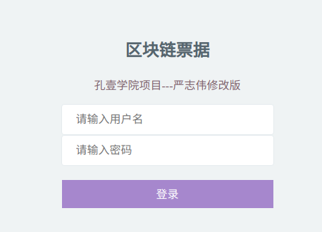
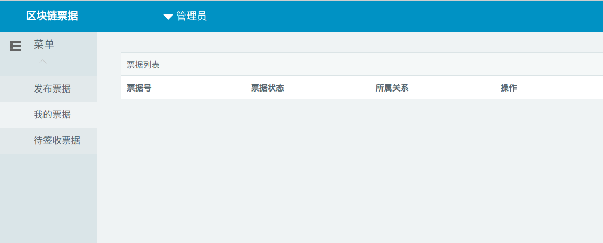

# 声明

本项目是孔壹学院的项目，本人对这个项目做了一定程度的修改，仅仅作为学习之用。

# cli测试

建议在启动网络之前，清除已经不需要的链码镜像（docker images ls），以避免测试过程失败。
```
make env-clean
make env-up

docker exec -it cli bash
export CHANNEL_NAME=mychannel
peer channel create -o orderer.example.com:7050 -c $CHANNEL_NAME -f ./channel-artifacts/mychannel.tx --tls --cafile /opt/gopath/src/github.com/hyperledger/fabric/peer/crypto/ordererOrganizations/example.com/orderers/orderer.example.com/msp/tlscacerts/tlsca.example.com-cert.pem
peer channel join -b mychannel.block
peer chaincode install -n mycc -v 1.0 -p github.com/chaincode
peer chaincode instantiate -o orderer.example.com:7050 --tls --cafile /opt/gopath/src/github.com/hyperledger/fabric/peer/crypto/ordererOrganizations/example.com/orderers/orderer.example.com/msp/tlscacerts/tlsca.example.com-cert.pem -C $CHANNEL_NAME -n mycc -v 1.0 -c'{"Args":["init"]}' -P "OR ('org1.example.com.member')"

peer chaincode invoke -o orderer.example.com:7050 --tls --cafile /opt/gopath/src/github.com/hyperledger/fabric/peer/crypto/ordererOrganizations/example.com/orderers/orderer.example.com/msp/tlscacerts/tlsca.example.com-cert.pem -C $CHANNEL_NAME -n mycc  -c '{"Args":["issue","BOC1001","20000","111","20180101","20180111","111","111","111","111","111","111","jack","jackID"]}'
peer chaincode invoke -o orderer.example.com:7050 --tls --cafile /opt/gopath/src/github.com/hyperledger/fabric/peer/crypto/ordererOrganizations/example.com/orderers/orderer.example.com/msp/tlscacerts/tlsca.example.com-cert.pem -C $CHANNEL_NAME -n mycc  -c '{"Args":["issue","BOC1002","10000","111","20180101","20180111","111","111","111","111","111","111","jack","jackID"]}'
peer chaincode query -C $CHANNEL_NAME -n mycc -c '{"Args":["queryBills","jackID"]}' 

peer chaincode invoke -o orderer.example.com:7050 --tls --cafile /opt/gopath/src/github.com/hyperledger/fabric/peer/crypto/ordererOrganizations/example.com/orderers/orderer.example.com/msp/tlscacerts/tlsca.example.com-cert.pem -C $CHANNEL_NAME -n mycc  -c '{"Args":["endorse","BOC1001","alice","aliceID"]}'
peer chaincode invoke -o orderer.example.com:7050 --tls --cafile /opt/gopath/src/github.com/hyperledger/fabric/peer/crypto/ordererOrganizations/example.com/orderers/orderer.example.com/msp/tlscacerts/tlsca.example.com-cert.pem -C $CHANNEL_NAME -n mycc  -c '{"Args":["accept","BOC1001","alice","aliceID"]}'
peer chaincode query -C $CHANNEL_NAME -n mycc -c '{"Args":["queryBillByNo","BOC1001"]}' 

peer chaincode invoke -o orderer.example.com:7050 --tls --cafile /opt/gopath/src/github.com/hyperledger/fabric/peer/crypto/ordererOrganizations/example.com/orderers/orderer.example.com/msp/tlscacerts/tlsca.example.com-cert.pem -C $CHANNEL_NAME -n mycc  -c '{"Args":["endorse","BOC1002","alice","aliceID"]}'
peer chaincode invoke -o orderer.example.com:7050 --tls --cafile /opt/gopath/src/github.com/hyperledger/fabric/peer/crypto/ordererOrganizations/example.com/orderers/orderer.example.com/msp/tlscacerts/tlsca.example.com-cert.pem -C $CHANNEL_NAME -n mycc  -c '{"Args":["reject","BOC1002","alice","aliceID"]}'
peer chaincode query -C $CHANNEL_NAME -n mycc -c '{"Args":["queryBills","jackID"]}' 
peer chaincode query -C $CHANNEL_NAME -n mycc -c '{"Args":["queryBillByNo","BOC1002"]}' 

```
你也可以通过脚本文件测试
```
make env-clean
make env-up

docker exec -it cli bash
./scripts/startup.sh

```
相关命令：
```
peer channel list //查看通道
peer chaincode list --instantiated -C mychannel  //查看通道中被安装的链码
```
# 服务层测试

解开业务层（服务层）测试程序的注释，然后执行如下命令：
```
make
```
输出结果如下：

```
Start app ...
Instantiating SDK...
Instantiate Fabric SDK successed!
creating channel...
create channel succeed!
Peers join channel succeed!
InstallAndInstantiateCC...
install chaincode succeed!
Instantiate chaincode...
Instantiate chaincode succeed!
create application channel client succeed!
&{0xc0002daff0 0xc0002466e0 0xc0002db1a0 0xc0002db0e0}
票据发布成功, 交易编号为: d61523f0a531955f6d9f11028ed01c9bd00fd807a1f1ece0b35eb76c2dd8d9e1
票据发布成功, 交易编号为: 04cd813c1113b95e9f85aee2278c37e1750c2fa2da5b5223c61bf70d0b7e46fb
根据持票人证件号码查询票据列表成功
{BOC1001 20000 111 20180101 201801011 111 111 111 111 111 111 jack jackID     NewPublish []}
{BOC1002 10000 111 20180101 201801011 111 111 111 111 111 111 jack jackID     NewPublish []}
票据背书请求成功
查询待背书票据列表成功
{BOC1001 20000 111 20180101 201801011 111 111 111 111 111 111 jack jackID alice aliceID   EndorseWaitSign []}
票据背书签收成功
{BOC1001 20000 111 20180101 201801011 111 111 111 111 111 111 alice aliceID     EndorseSigned 
[{d61523f0a531955f6d9f11028ed01c9bd00fd807a1f1ece0b35eb76c2dd8d9e1 {BOC1001 20000 111 20180101 201801011 111 111 111 111 111 111 jack jackID     NewPublish []}} 
{f98565e18c9b3b797682894b2631a3e618ec53e368a8ffa1795b9b913e14b5f4 {BOC1001 20000 111 20180101 201801011 111 111 111 111 111 111 jack jackID alice aliceID   EndorseWaitSign []}} 
{1e3847941f513afc0ea1734178672d34ca4e9f652013aed4a30961da2f4ed704 {BOC1001 20000 111 20180101 201801011 111 111 111 111 111 111 alice aliceID     EndorseSigned []}}]}
票据背书请求成功
票据背书拒签成功
{BOC1002 10000 111 20180101 201801011 111 111 111 111 111 111 jack jackID   alice aliceID EndorseReject 
[{04cd813c1113b95e9f85aee2278c37e1750c2fa2da5b5223c61bf70d0b7e46fb {BOC1002 10000 111 20180101 201801011 111 111 111 111 111 111 jack jackID     NewPublish []}} 
{d6c908188f6273ac81f70346c2347a1135168640b2664d0334fe1ec1c631b89c {BOC1002 10000 111 20180101 201801011 111 111 111 111 111 111 jack jackID alice aliceID   EndorseWaitSign []}} 
{a26c5358cec9f75f614d3aed3280915c8baaf5eef61a32e294fb18b76c22505f {BOC1002 10000 111 20180101 201801011 111 111 111 111 111 111 jack jackID   alice aliceID EndorseReject []}}]}
```
解释以下：签收和拒签后有多条票据交易信息，这些都是这个票据的交易记录。


# Web层测试

执行命令：
```
make
```
成功时输出的结果：
```
Start app ...
Instantiating SDK...
Instantiate Fabric SDK successed!
creating channel...
create channel succeed!
Peers join channel succeed!
InstallAndInstantiateCC...
install chaincode succeed!
Instantiate chaincode...
Instantiate chaincode succeed!
create application channel client succeed!
&{0xc000202f30 0xc000248910 0xc0002030b0 0xc000202ff0}
启动Web服务, 监听端口号为: 9000
```
在浏览器的网址栏输入http://127.0.0.1:9000/，即可打开网页，打开
后的网页效果如下：



密码见web/userInfo（如；Admin,123456）

成功登录后的界面如下所示：



以下开始测试，测试方法我参考服务层测试：

1.让jack发布两张票据

使用jack 账户密码登录系统（jack,123456）,进入系统后在发布票据页面如下输入数据

> 票据号码：BOC10000001
> 票据金额：20000
> 票据类型：111
> 票据出票日期:20180101
> 票据到期日期:20180111
> 出票人名称：111
> 出票人证件号：111
> 承兑人名称：111
> 承兑人证件号：111
> 收款人名称：111
> 收款人证件号：111
> 持票人名称：Jack
> 持票人证件号：JackID

再发布一张票据：

> 票据号码：BOC10000002
> 票据金额：10000
> 票据类型：111
> 票据出票日期:20180101
> 票据到期日期:20180111
> 出票人名称：111
> 出票人证件号：111
> 承兑人名称：111
> 承兑人证件号：111
> 收款人名称：111
> 收款人证件号：111
> 持票人名称：Jack
> 持票人证件号：JackID

发布票据页面中，输入框中设置了默认值，直接点击提交将提交默认值，再查询票据信息时见隐藏。

2.查询jack的票据

点击左侧“我的票据”，你会发现票据列表下多了两行票据信息，然后点击对应票据的详情按钮可查询票据详情信息。

3.jack向alice发起签收票据请求

进入jack的BOC10000001票据详情页，在最下方（“若发起背书请填写被背书人信息”）输入如下内容：

> 被背书名称 Alice
> 被背书证件号码 AliceID

点击发起背书按钮，成功发起背书

切换用户：退出jack账户，使用alice账户(alice,123456)再登录系统，进入alice的账户中。

4.alice签收票据

进入alice账户中，在“待签收票据”页面中应该会新增一条“待背书”票据信息记录。点击该票据右侧的“详情”按钮，即可进入该票据的详情页。进入详情页面之后，点击左下方的“签收背书”按钮，将成功签收票据。点击左侧“我的票据”，应该可以发现alice的票据列表中新增了一份票据，且这份BOC10000001票据的持有人变为了Alice,如果你使用jack,账户登录将会发现，jack的所属票据中不在有BOC10000001这个票据。

5.Alice拒签票据

首先jack将票据BOC10000002发送给alice签收，过程如步骤3。之后与步骤4不同的是，选择“拒绝背书”按钮，将成功拒绝签收票据，拒签成功之后，票据号为BOC10000002的票据所有权仍然归jack所有，在jack的账户系统中能够看到这个票据的历史流转信息。
